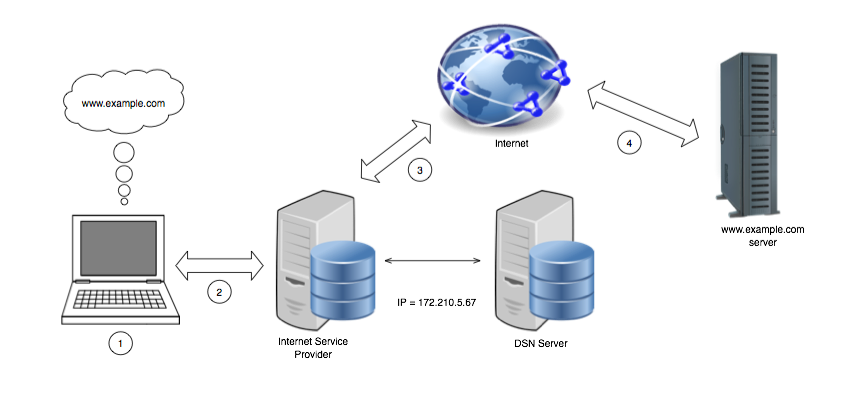

#背景

###简要的概述和历史回顾

当你在浏览器地址栏输入URL的时候，你希望看到在你的浏览器里显示这个网站。当你点了一个链接，或者提交了一个表单，你的浏览器可能会显示下一个页面，或者在你的表单中显示一些错误提示，以便你能纠正它们并再次提交。你的浏览器就是一个接口，或者说一扇窗，通过她你就可以与万维网进行互动与交互。

在你的浏览器的后面，有一堆文件 -- CSS, HTML, Javascript, 视频文件，图片文件等等 -- 这些文件构成了你所看到的页面。所有这些东西都是通过一个叫做HTTP的传输协议从**服务器**传输到你的浏览器，也就是**客户端**里(所以你现在知道为什么在浏览器地址栏输地址的时候前面加的是"http://"了吧)。

HTTP，或者超文本传输协议，是上世纪80年代由蒂姆·伯纳斯-李发明的。它是一个各种规则组成的系统，是一种协议，把应用程序和超文本文档之间的传输联系起来。换句话说，HTTP就是机器之间彼此沟通的一个协议，或者说一个消息格式。HTTP 遵循一个简单的模型：从客户端发出请求到服务器并等待响应。因此它也被认为是一种请求响应协议。也就是把请求和响应看作短信，或者字符串，这些短信或者字符串的写法遵循着一个规则，能保证其他机器能够理解上面的内容。

HTTP协议从创立之初已经经过了一些变化。最开始的时候这个协议仅仅返回HTML页面。在1991年，第一个文档 HTTP/0.9发布。1992年，HTTP/1.0发布，并支持传输不同的文件类型，比如CSS文件，视频，脚本和图片。1995年，HTTP/1.1介绍了连接复用和其他的一些特性。1999年又对HTTP/1.1做了一些改进，我们现在看到的就是这一版本。在撰写本文时，HTTP/2正处于开发初期。

###英特网是如何工作的
英特网是由数以百万计允许各种计算机和设备相互沟通的互联网络构成。按照惯例，网络内的所有设备都提供独特的标签。这种标签的总称是互联网协议地址或IP地址，是类似于在互联网上的计算机的电话号码。此外，IP地址还有端口号，这会提供更多关于如何与其交流的细节(类似于分机号码)。IP地址一般都长这样：
```
192.168.0.1
```
当需要一个端口号的时候，这样：
```
192.168.0.2:1234
```
IP地址是```192.168.0.2```，端口号是```1234```。
IP地址是设备或服务器的标识符，可以包含数以千计的端口，每个端口都用于不同的交互目标。

在更广阔的互联网上，每个设备都有互联网服务供应商(ISP)提供的公用 IP地址, 通过这些地址，它们可以进行高效的沟通。当我们想访问Google的主页的时候，我们并没有在浏览器里输入它的IP地址，我们只是输入Google的URL ```http://www.google.com```，但是像```http://www.google.com```这样一个地址，你的电脑是怎么知道它的IP地址的呢？

###DNS
URL和IP地址之间的对应由域名解析系统也就是常说的DNS来控制。DNS是一个分布式数据库，把像```http://www.google.com```这样的域名翻译成IP地址，并将请求映射到远程服务器。换句话说，DNS在互联网上追踪URL和它对应的IP地址。所以像```http://www.google.com```这样的域名会被解析成一个IP地址```197.251.230.45```。顺便提一下，通过在浏览器地址栏里敲IP地址也能访问网站。
不过，比起记一串数字来说，大多数人还是喜欢使用一个用户友好的地址如```http://www.google.com//```这样的。DNS数据库被安装在叫做DNS服务器的设备上。重要的一点是，DNS服务器是由一个巨大的，全世界范围的网络层次结构组成的服务器集群，没有一个单一的DNS服务器中包含完整的数据库。如果一个DNS服务器里没有一个请求需要的域名，这个DNS服务器就会把请求转发给这个集群上更上一层节点的DNS服务器。最终，这个域名会在某个DNS服务器上的数据库里被发现，然后它对应的IP地址所代表的设备就会来接受这个请求。
你通过浏览器与互联网交互的一个典型实例是这样的：

1. 在浏览器里输入类似```http://www.google.com```这样的地址。
2. 你的请求被发送到你设备的网络接口。
3. 这个请求的互联网之旅从搜索```http://www.google.com```的IP地址开始。在屏幕后面，```http://www.google.com```代表了一个与某个远程服务器关联的IP地址的人类友好的名称。
4. 远程服务器接受请求并将响应通过互联网发送到你的网络接口，并把它交给你的浏览器。
5. 最终，浏览器把这个响应作为一个网页的形式呈现在你面前。

有一点你要明白，当你的浏览器发出请求的时候，它只是发送了一些文本到一个IP地址。因为客户端(浏览器)和服务器(请求接收者)之间有一个HTTP形式的约定，或者协议，服务器可以分析请求，了解其组成并将响应发送回web浏览器。然后，web浏览器将响应字符串处理成你能理解的内容。浏览像Facebook，Google和Twitter这样的网站，就意味着你一直在使用HTTP。这些细节都被隐藏了，你的浏览器会自动处理好请求和响应。互联网的不同部分看起来像是这样的：

###客户端和服务器
最常见的客户端是你每天与之交互，被称为Web浏览器的应用程序。Web 浏览器常见的有Internet Explorer、 火狐、 Safari，包括移动版本。Web浏览器的职责是发送HTTP请求，并将响应处理成人类友好的形式显示在你的显示器上。web浏览器并不是唯一的客户端，有很多工具或者应用都能发送HTTP请求。

你的请求的内容最终的接收者是被称为服务器的远程计算机。服务器也没啥神秘的，就是处理请求的设备，它们的工作就是发送一个响应回去。通常情况下，服务器发送回去的响应里面都包含了请求中指定的一些数据。

###资源(Resources)
资源是一个通用术语，指的是互联网上你通过URL与其交互的东西。包括了图片，视频，网页和其他文件。资源并不限于文件或者网页。资源也可能是一个软件，一个炒股的软件，一个游戏。互联网上有无数的资源。


###无状态的(statelessness)
当一个协议设计成每一个请求/响应周期与前一个都是完全无关的话，我们就说这个协议是无状态的。对于HTTP要知道的一点就是，无状态协议对于服务器资源和易用性的影响。也就是说在HTTP一对儿请求/响应之间，服务器不需要挂起等待之类的动作。结果就是当一个请求到达服务器，这个系统的任何部分不会做任何清理。以上两个原因让HTTP协议变的很灵活，但同时也变的很难构建有状态的应用。因为HTTP本质上是个无状态的互联网协议，这就意味着web开发人员在构建有状态应用的时候，不得不努力想办法来模拟web应用中的有状态体验。
举个例子，当你上Facebook的时候，你先登录，然后你看到了一个Facebook的网页。这就是一个完整的请求/响应周期。你点了一张照片 -- 另一个请求/响应周期 -- 但是在第二个动作之后你并没有退出登录。如果HTTP是无状态的，它是怎么维持状态并且知道你刚刚已经登录过了呢？事实上，如果HTTP是无状态的，Facebook是怎么知道哪个请求是你发出的？它是怎么区分你和其他用户的？这些都是web开发人员和web开发框架耍的小诡计，让web应用看起来像是有状态的，不过这些小诡计不在本书的讨论范围内。你所要记住的就是，尽管你觉得这个应用是有状态的，但是在它背后，这个web应用是构建在HTTP，一个无状态协议之上的。以上，就是为什么web如此灵活，可以分布式处理，又特别难控制，也是为什么web的安全性难以保证，也是为什么在web上构建应用不是易事。

###小结
本章用一种简单的描述解释了互联网如何工作和几个术语。你也学到了无状态对web应用的影响。在下一章，我们会深入探讨```http://www.google.com```这样的地址到底是什么以及它是如何构建的。
