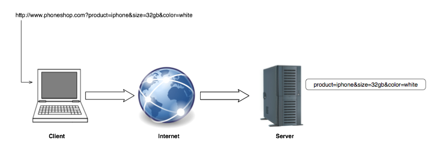

# 什么是 URL？

### 简介

当你想去某人家里的时候，你要知道他家的地址。如果你想给你朋友打电话，你要知道你朋友的电话号码。没有这些信息，你想去别人家或者给人打电话都是不可能的。换句话说，如果你有别人的住址或者电话号码，你能立刻知道谁是谁，因为地址和电话号码都有其唯一性。

在互联网上寻找和访问服务器也是同样的一个概念。当你想上 Facebook 的游戏站的时候，你会打开浏览器然后输入 [http://www.facebook.com/games](http://www.facebook.com/games)。web 浏览器向这个地址发送一个 HTTP 请求，然后拿回这个地址的响应结果。你刚刚输入的那个地址，[http://www.facebook.com/games](http://www.facebook.com/games) 就是所谓的统一资源定位符 (Uniform Resource Locator) 或 URL。URL 就像是你跟你朋友沟通所需要的电话号码或者地址一样的存在。URL 应该是统一资源标识符 (Uniform Resource Identifier) 这个笼统的概念的一种最常见的形式。本章我们讨论什么是 URL 及其组成部分，和对你这个 web 开发者来说 URL 意味着什么。

### URL 组成部分
当你看到一个 URL，比如```http://www.example.com/home```，其实是由几个组件构成的。我们可以把这个 URL 分解成 3 部分：

* ```http```：通常被称为 URL 模式（ scheme ）。总是出现在冒号和两个斜杠之前，作用是告诉 web 客户端怎样去访问一个资源。在本例中，它告诉 web 客户端使用超文本传输协议也就是 HTTP 去发起一个请求。常见的 URL 模式还有```ftp```，```mailto```和```git```。
* ```www.example.com```：URL 的第二个部分，就是资源路径或主机 (host)。它告诉客户端，资源的确切位置。
* ```/home/```：URL 的第三个部分就是 URL 路径。它代表了客户端正在请求什么样的本地资源 (对于服务器来说)。


有时候，这个路径指向了一个主机上特定的资源。比如，```www.example.com/home/index.html```指向了 example.com 服务器上的一个 HTML 文件。

另外，URL 可以包含一个主机用来监听 HTTP 请求的端口号。一个```http://localhost:3000/profile```这样的 URL，通过 3000 端口去监听 HTTP 请求。web 客户端用来监听 HTTP 请求的默认端口号是 80，如果一个 URL 中没有指定其他的端口号，那就等价于写了80 **除非指定了其他的端口号代替，不然端口号80会被默认用于正常的 HTTP 请求**。

### 查询字符串 / 参数
一个查询字符串或者参数是 URL 的一部分并且通常都包含一些要发往至服务器的各种类型的数据。一个简单的带查询字符串的 URL 长这样：

```ruby
http://www.example.com?search=ruby&results=10
```

让我们拆开来看看：

|查询字符串组件   | 描述             |
|:------------- |:--------------- |
|?              |这是个保留字，标识着查询字符串的开始 |
|search=ruby    |这是一个参数的键/值对儿        |
|&              |这是个保留字，需要给查询字符串添加参数时使用|
|rasult=10      |这也是一个参数的键/值对儿      |

现在我们再来看一个例子。假设我们有下面这个 URL:

```ruby
http://www.phoneshop.com?product=iphone&size=32gb&color=white
```


在上面这个例子里，键/值对儿```product=iphone```，```size=32gb```，```color=white``` 通过 URL 传给了服务器。这个请求告诉```www.phoneshop.com```的服务器，把要请求的资源条件限制在```产品 iphone```，```大小 32gb```和```颜色白色```。服务器怎么样使用这些参数取决于服务端的应用的处理逻辑。

另一个经常见到查询字符串的情况是当你在搜索引擎上搜索东西的时候。**因为查询字符串是通过 URL 传递的，他们仅使用 HTTP 的 GET 请求**。在本书后面的章节里我们会讨论不同的 HTTP 请求，但是现在你所需要知道的是，当你不论什么时候在浏览器的地址栏里输入网址进行浏览的时候，你就是在发起 HTTP 的 GET 请求。大部分超链接都是 HTTP 的 GET 请求，偶尔会有一些例外。



使用查询字符串向服务器传递附加信息是个很棒的方法，但是对于查询字符串的使用，以下是一些限制：

* 查询字符串有最大长度。所以，如果你大量的数据需要传输，还是不要用查询字符串的好。
* 查询字符串中使用的键/值对儿是显示在 URL 上的。所以，不推荐用查询字符串传输敏感信息比如用户名或密码。
* 查询字符串中无法使用空格和特殊字符比如```&```。它们必须用 URL 编码代替，我们接下来会讨论这个。

### URL 编码 (URL Encoding)

URL 在设计的时候就默认只接受 ASCII 码。因此，不安全的或者不是 ASCII 码的字符就要进行转义或者编码来适应这个格式。URL 编码的原理是将不符合格式的字符替换成```%```开头后面跟着两个十六进制数字代表的 ASCII 码的一串字符。

下面是一些常见的 URL 编码和实例 URL：

| 字符  | ASCII 码  | URL                                                   |
| :---- | :-- | :-------------                                            |
|space  | 020 | http://www.thedesignshop.com/shops/tommy%020hilfiger.html |
|!      | 041 | http://www.thedesignshop.com/moredesigns%041.html         |
|+      | 053 | http://www.thedesignshop.com/shops/spencer%053.html       |

符合下列条件的字符都要进行编码处理：

1. 没有对应的 ASCII 码。
2. 字符的使用是不安全的。比如```%```就是不安全的，因为它经常用于对其它字符进行转义。
3. 字符是有特殊用途的 URL 模式保留字。有些字符用于保留字是有着特殊的意义；它们在 URL 中的存在具有特殊用途。比如```/```，```?```，```:```，和```&```，都是需要进行编码的保留字。

比如```&```被保留用于查询字符串的分隔符。```:```也被保留用于分隔主机/端口号和用户名/密码。

那么什么样的字符能在 URL 里安全地使用呢？只有字母表里的和```$-_.+!'()，"```这些字符可以。如果保留字符被用于它应有的特殊用途，那么是可以不用编码的，不然也是必须要编码的。

### 小结
本章，我们讨论了什么是 URL。也认识了 URL 的组件并以对 URL 编码的探索结尾。在准备工作章节之后，我们会稍微深入一点，一起去看看请求和响应，还有它们的构成。
