# 发起 HTTP 请求

### 浏览器的 HTTP 请求

发起一个 HTTP 请求很容易。比如你说你想用浏览器访问 Reddit 。你所需要做的仅仅是启动浏览器然后在地址栏输入 [http://www.reddit.com](http://www.reddit.com)，然后你就可以看到:


承载 Reddit 网站的服务器处理你的请求并返回给你的浏览器一个响应。你的浏览器足够聪明去处理这个响应，然后将所有的颜色，图片，文字，样式给你展示成上图那样。

### 用 HTTP 工具发起 HTTP 请求

因为浏览器给我们展示的是处理过的服务器响应，我们看不到服务器发给我们的响应的本来面目。怎么样才能看到原始的 HTTP 响应数据呢？

为此，我们可以使用一个 HTTP 工具，就像用浏览器的时候我们输入网址一样，我们可以用 HTTP 工具发送一个请求到 [http://www.reddit.com](http://www.reddit.com)。我们的 HTTP 工具，Paw，不会处理响应数据，这样能让我们看到原始的响应数据，大概长这样：


跟你在浏览器里看到的简直就是天壤之别啊！如果你以前从来没见过原始的 HTTP 响应数据，这可能让你有点吃惊。你现在看到的这些，其实就是你浏览器接收到的数据，只不过是浏览器把这一堆数据处理成了人类友好的格式。

如果你学习 HTTP 的知识是为了成为一个 web 开发者，你需要学着阅读原始的 HTTP 响应数据。当然你不用在你的脑海里把这些数据解析成一个高清晰度的画面，但是你应该对这些响应代表着什么有一个整体上的概念。等你有了足够的经验，你就可以深入原始的 HTTP 响应数据去做一些 debug 工作和一探其究竟。

### 使用审查器 (Inspector)

所有现代浏览器都有查看 HTTP 请求和响应的方法，通常都叫做**审查器**。我们使用 [Chrome 审查器](https://developer.chrome.com/devtools)，演示一下如何用它来分析你浏览器的 HTTP 通信。

1. 打开 Chrome 浏览器，点击右上角的菜单，选择工具，然后选择开发者工具，这样就打开审查器了。
2. 在地址栏输入 [http://www.reddit.com](http://www.reddit.com)，来给 Reddit 重新发送一个新的请求。
3. 以上两个步骤要确保审查器开着啊，然后点击 Network 标签: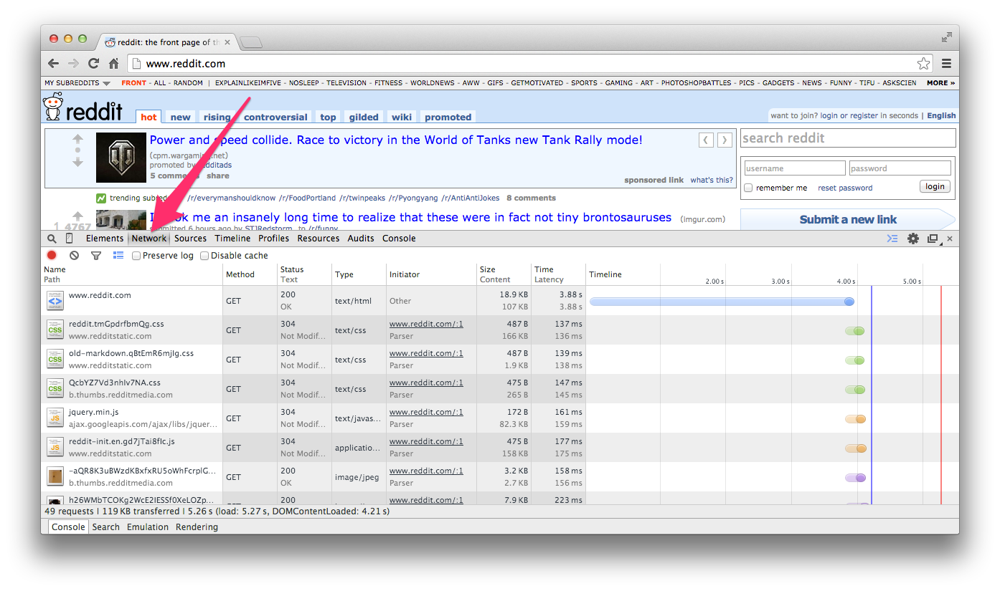
4. 你应该注意的第一件事是，这里会有很多项。每一项都是一个单独的请求，也就是说，仅仅是访问了这一个 URL，你的浏览器就发起了多个请求，一个请求对应着一个资源 （图片，文件等等）。点击一下对主页的第一个请求，就是```www.reddit.com```那项:
5. 这里，你就能看到特定的请求头部，cookies，还有原始的响应数据: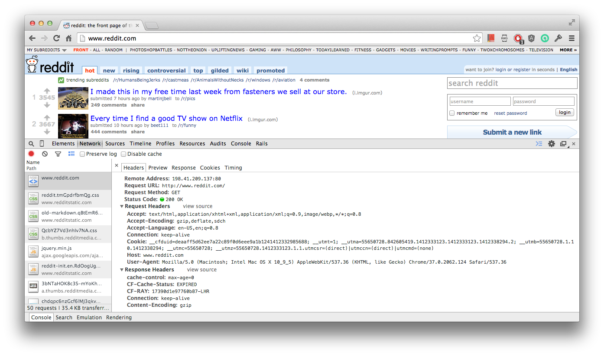 在默认的子标签 *Headers* 里显示了发给服务器的请求头部和接收到的服务器返回来的响应头部。接下来点击 *Response* 子标签去看看原始响应数据。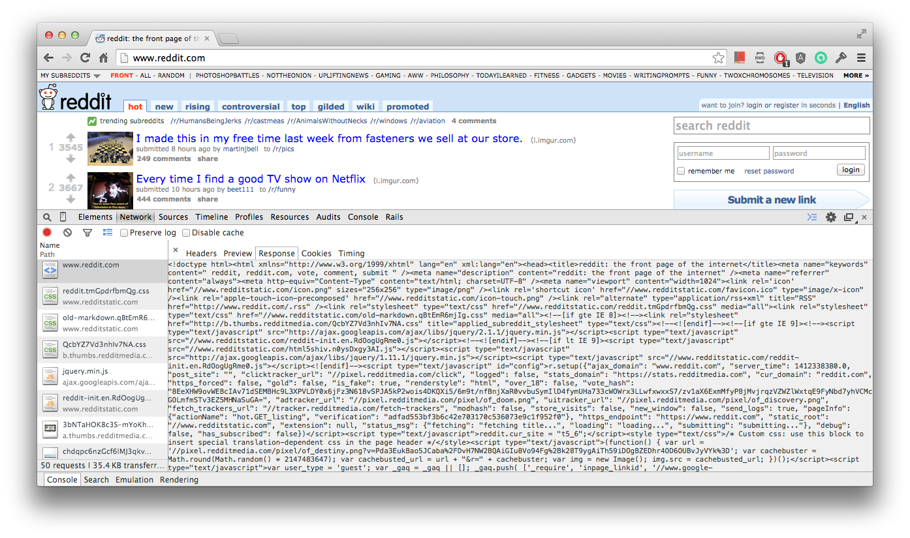
这个响应数据看起来应该跟我们前面使用 HTTP 工具得到的差不多。

另一个要注意的事情是，当我们使用审查器的时候，在 *Network* 标签下，除了第一个请求，还有一堆其他请求的返回：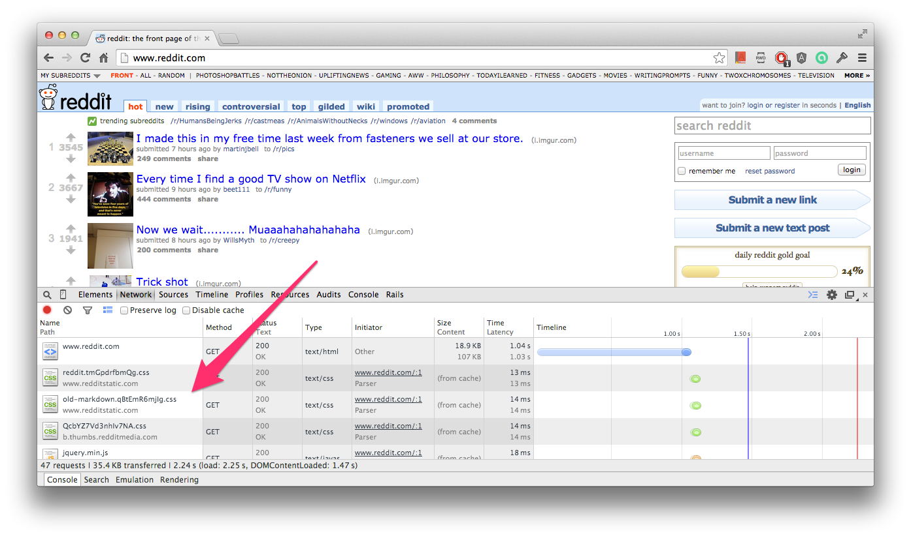

为什么会出现这些额外的响应，谁发起的这些请求？ 事情是这样的，当我们请求资源的时候，最初的对于```www.reddit.com```的请求，返回了一些 HTML。 这些 HTML 里又引用了其他的资源比如图片，CSS 文件，javascript 文件等等。你的浏览器，很聪明也很给力。它明白，为了展示出一个能够给人看的网页，它必须去把这些引用到的资源也一并拿来. 因此浏览器就会对得到的初次响应里的每一个资源再一一发起请求。当你在 *Network* 标签里往下滚动页面，你就能看到所有的相关资源。这些其他的请求保证了这个网页和其他一些东西能正常良好的显示在你的屏幕上.整体来看，浏览器的审查器对于相关的引用资源给你了一个良好的体验.另一方面，一个纯粹的 HTTP 工具，只会返回**一个**巨大的响应数据，并不会自动拉取引用的资源.一个用```curl```发起的请求可以这样写：


$ curl -X GET "http://www.reddit.com/" -m 30 -v


然后你看到的应该只是一个请求，一个响应包含着 HTML，但是没有那些你在浏览器里看到的自动发起的额外请求。

### 请求方法
让我们重温一下上面第 3 步里的图，看看 *Network* 标签里的响应数据。你会发现有这么两列 **Method** 和 **Status** 。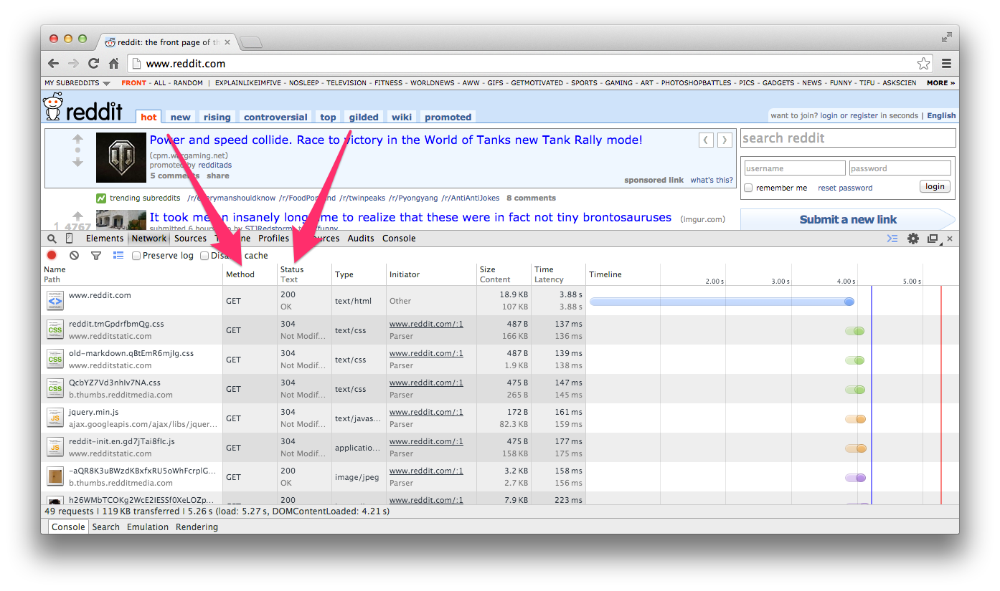

本节我们来看看这几列里的信息是什么意思。

在 **Method** 这一列里的数据呢，就是常说的 HTTP 请求方法 （ Request Method ）。你可以这样想，把这个 Method 当做是一个动词，用来告诉服务器你想对某个资源做什么。最常见的两个 HTTP 请求方法是 ```GET``` 和 ```POST``` 。当你想要获取信息的时候，使用```GET```这个最常用的 HTTP 请求方法。在上面那张图你应该能看到，所有使用 ```GET``` 的请求，都是为了去拿到那些需要显示在网页上的资源。

**Status** 这列显示了每一个请求的响应状态码。在本书的后面章节我们会详细讨论响应。现在你需要理解的是每一个请求都会得到一个响应，哪怕这响应是一个错误响应 -- 那它也是个响应嘛。（这句话其实不是百分百正确，因为有些响应会**超时**，但是现阶段我们不用在意这些细节。）

### GET 请求
```GET``` 请求一般出现在超链接或者浏览器的地址栏里。当你在你的浏览器地址栏里输入类似 ```http://www.reddit.com``` 这样的地址的时候，你就是在发起一个 GET 请求。你让浏览器去取这个地址上的资源，这就意味着我们在整本书里一直在使用```GET```请求。在你点击 web 应用上的超链接的时候也会发生同样的事情。超链接的默认行为就是向一个 URL 发送```GET```请求。让我们用 HTTP 工具向 ```http://www.reddit.com``` 发起一个简单的 ```GET``` 请求。要确保你选择了 ```GET``` 这一项，然后输入网址: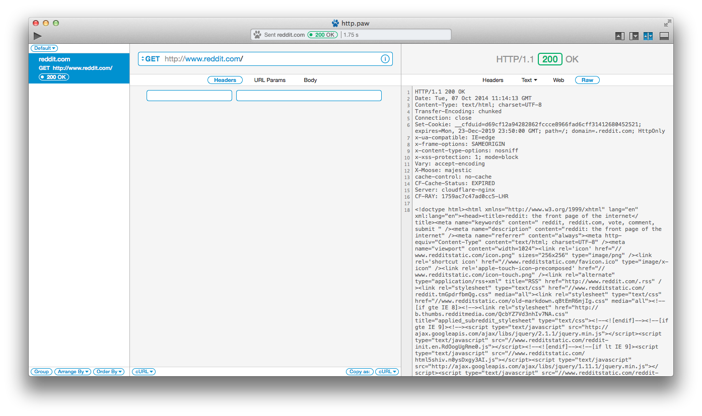

在右边窗口你就能看到服务器发回来的原始 HTTP 响应数据和一些其他信息。

使用 ```curl``` 的读者呢，可以在终端里敲入以下命令：


curl -X GET "http://www.reddit.com/" -m 30 -v


我们也可以用 HTTP 工具发送带查询字符串的请求.举个例子，我们发起一个带查询字符串的请求去搜索```https://itunes.apple.com/```里所有跟```Michael Jackson```有关的东西.请求使用的 URL 长这样：


https://itunes.apple.com/search?term=Michael%20Jackson


还是那句话，用 Paw 的，发起请求前确保选的是```GET```。

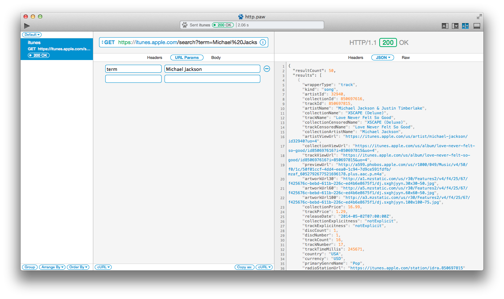

这里我们仅仅是给```https://itunes.apple.com/```的服务器发送了一个带着参数 ```term=Michael%20Jackson``` 的 HTTP ```GET``` 请求，其中```%20```是空格的 URL 编码字符。

这个例子所用的```curl```命令是这样的：


以上就是你现阶段需要知道的所有关于发起 HTTP ```GET``` 请求的所有知识。主要的概念有以下几点：

* ```GET``` 请求经常用于取得一个资源，而且大部分超链接都是 ```GET``` 请求。
* 一个 ```GET``` 请求的响应可以是任何东西，但是如果响应是一个 HTML 并且里面引用了其他资源，你的浏览器会自动对这些资源发起请求，而一个纯粹的 HTTP 工具则不会。
* 使用 ```GET``` 请求的时候在大小和安全性上有一些限制。

### POST 请求
我们已经看到了怎么使用 ```GET``` 去从一个服务器取得和请求数据，但是如果我们需要给服务器提交一些数据怎办呢？这就要提到另一个非常必要和重要的 HTTP 请求法方法 ```POST``` 啦。当你想在服务器上发起某个行动，或者给服务器发送数据的时候，就要用到 ```POST``` 了。让我们用 HTTP 工具来举个例子：

###POST 请求
我们已经看到了怎么使用 ```GET``` 去从一个服务器取得和请求数据，但是如果我们需要给服务器提交一些数据怎办呢？ 这就要提到另一个非常必要和重要的 HTTP 请求法方法```POST```啦。当你想再服务器上采取一些行动，或者给服务器发送数据的时候，就要用到 ```POST``` 了。让我们用 HTTP 工具来举个例子：


按照惯例给出 curl 命令：


$ curl -X POST "http://echo.httpkit.com" -m 30 -v


上面的图片显示了对 ```http:echo.httpkit.com``` 发起的 ```POST```请 求和服务器返回的响应。浏览器里的典型 ```POST``` 使用案例就是你提交一个表单的时候。```POST``` 请求允许我们向服务器发送更大或者敏感的数据，比如图片或者视频。举个例子，比如我们要把我们的用户名和密码发送到服务器上去做验证。我们完全可以使用 ```GET``` 通过附加查询字符串把数据发给服务器。这样做的毛病很明显： 我们的验证信息在 URL 上是可见的。这必然不是我们想要的。在表单提交上使用 ```POST``` 请求能够解决这个问题。而且 ```POST``` 请求也能避免你使用 ```GET``` 请求时的查询字符串长度限制问题。通过 ```POST``` 请求，我们可以给服务器发送更大的数据。

我们再来看一个使用 ```POST``` 请求提交 web 表单的例子。在浏览器里我们的示例表单长这样：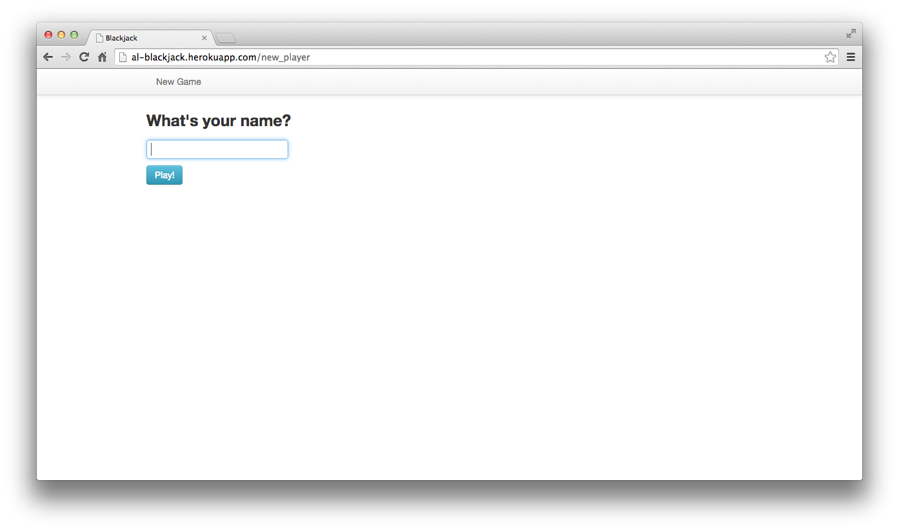

提交表单后，你会被重定向到这样一个页面：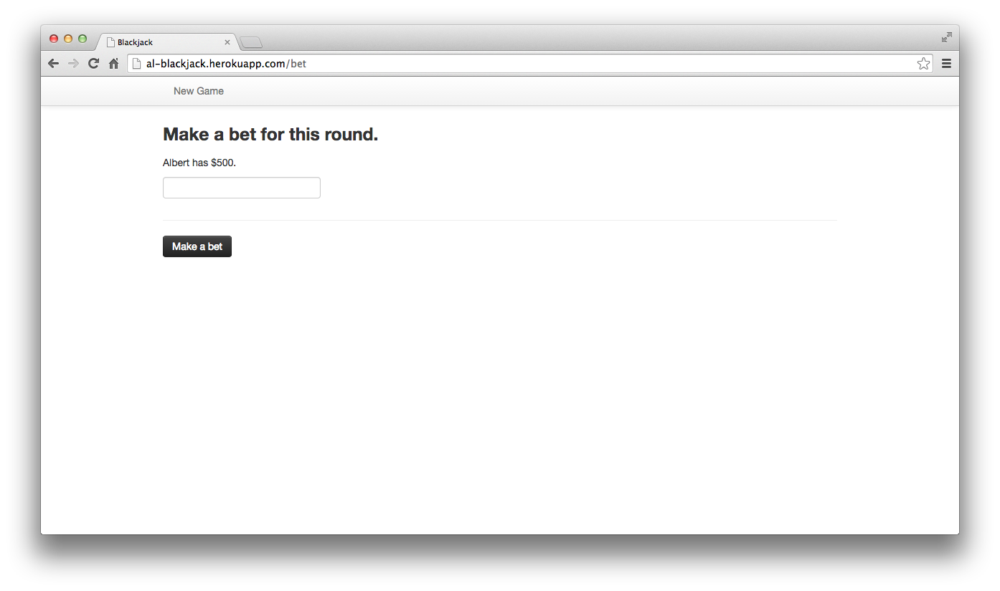

现在让我们切换到我们的 HTTP 工具，来模拟一下我们刚才在浏览器里做的事情。我们要发起一个 ```POST``` 请求到 ```http://al-blackjack.herokuapp.com/new_player``` 来代替在浏览器里填写表单。下面是我们填写第一个表单（就是那个我们写名字的那个）的方法：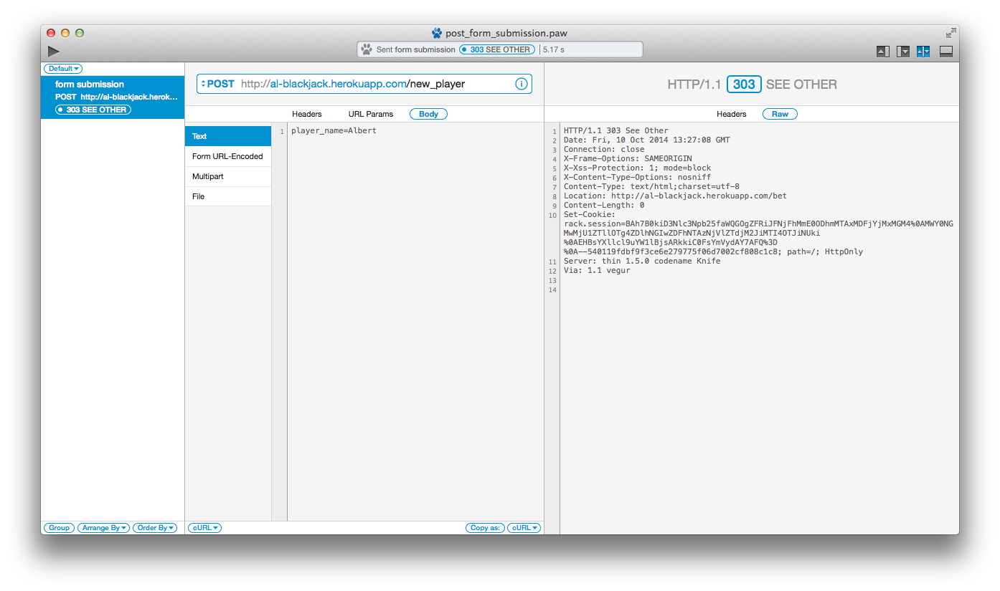

或者用 curl：


$ curl -X POST "http://al-blackjack.herokuapp.com/new_player" -d "player_name=Albert" -m 30 -v


注意在图片和 curl 命令里我们都提供了额外的参数： ```player_name=albert``` 。 这个跟我们在第一个表单的 “What's your name?” 输入框里填写内容并提交是一样的。

我们可以使用审查器查看内容 （右键选择```审查元素```）。你能看到，我们在 ```POST``` 请求里发送的参数 ```player_name``` 就是这个表单里面 input 元素的 name 属性里的内容：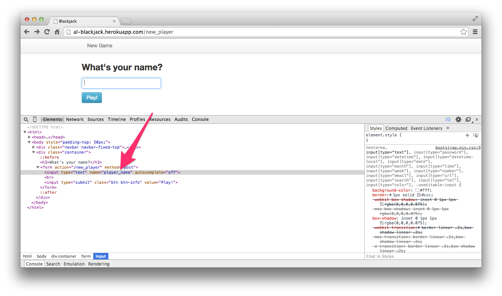

这个的奥秘在于，我们是怎样不通过 URL，仅仅是提交表单就把数据发送到服务器的呢？答案是 HTTP 的正文 （ Body ）。正文包含了正在传输的 HTTP 消息，这个内容是可选的。换句话说就是，可以发送一个没有正文的 HTTP 消息。当你要使用正文的时候，可以包含 HTML，图片，音频等等。你可以把正文看成包裹在信封里发出的信件（译注:URL 就好比是信封上写的地址，是可见的，而信的内容在信封里是不可见的）。

HTTP 工具和 curl 发起的 ```POST``` 请求跟你在浏览器里填写表单然后提交是一样的，紧接着我们会被重定向到下一个页面。仔细看看 HTTP 工具的图片，看看里面的原始响应数据，把我们重定向到下一个页面的关键信息在这一行 ```Location: http://al-blackjack.herokuapp.com/bet``` 。 ```Location``` 和它对应的数据，就是所谓的 HTTP 响应头部里的一部分 （是的，你可能也想到了，请求也有头部，但是在现在这个例子里，这是一个响应头部）。不要太在意这些细节，在后面章节我们会讨论头部。当你的浏览器看到这个响应头部，然后就会自动向 ```Location``` 头部里的 URL 发起一个全新的，完全独立的请求。你看到的那个 "Make a bet" 表单，就是这第二个请求的响应内容。

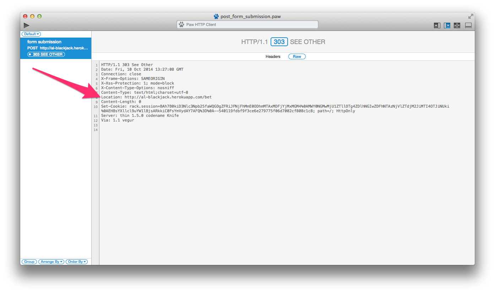

如果你对上面几段内容感到困惑，那就再多看两遍。使用浏览器的时候有一点很重要，那就是浏览器对你隐藏了大量的 HTTP 请求/响应的细节。你的浏览器发起最初的一个 ```POST``` 请求，得到了一个包含 ```Location``` 头部的响应，然后在不用你参与的情况下发起另一个请求，然后把第二个请求得到的响应内容展示给你。再重申一次，如果你使用的是一个纯粹的 HTTP 工具，你能看到第一个 ```POST``` 请求的 ```Location``` 响应头部，但是这个工具不会自动发起第二个请求。（有些 HTTP 工具有这个功能，你可以看看 "automatically follow redirects" 选项）

### HTTP 头部
HTTP 头部允许客户端和服务器在请求/响应的 HTTP 周期里发送额外的信息。头部，通常是以冒号分隔的键值对儿，一般是纯文本格式的。我们可以使用**审查器**来看看这些头部。下面这张图你能看到请求和响应都有头部：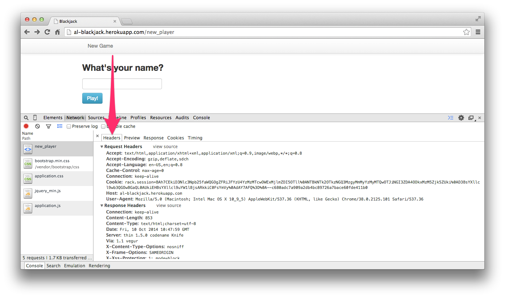

上图显示了在一个请求/响应周期里传递的各种头部。更进一步，在 ```Request Headers``` 下面，我们能看到请求和响应包含着不同的头部：

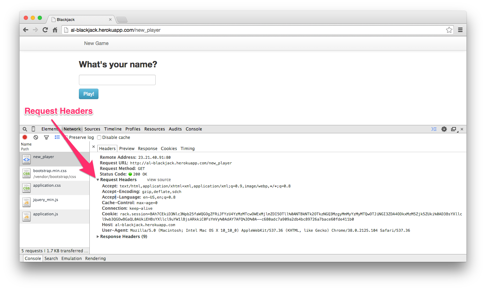

### 请求头部
请求头部提供更多关于服务器和要获取的资源的信息。一些有用的请求头部是:

| 字段名  | 描述  | 举例 |
|:------------- |:---------------| :-------------|
| Host     | 服务器域名 | Host:www.reddit.com  |
| Accept-Language | 可接受的语言 | Accept-Language: en-US，en;q=0.8 |
| User-Agent | 一个标识客户端的字符串 |User-Agent: Mozilla/5.0 (Macintosh; Intel Mac OS X 10_9_5) AppleWebKit/537.36 (KHTML，like Gecko) Chrome/38.0.2125.101 Safari/537.36|
| Connection | 客户端连接的类型 | Connection: keep-alive |

没有必要去记忆任何一个请求头部，但是一定要知道这是发送到服务器请求里的一部分。在下一章我们会讨论响应头部。

### 小结
本章我们做了一个简单的 HTTP 请求介绍。读完本章你应该能熟练应用：

* 使用审查器查看 HTTP 请求
* 使用 HTTP 工具发起 GET/POST 请求

关于 HTTP 请求最终的部分是理解以下内容：

* URL
* 参数
* 头部

* 消息正文 （在 ```POST``` 请求里的）

下一章我们将通过学习 HTTP 响应来继续了解 HTTP 。
