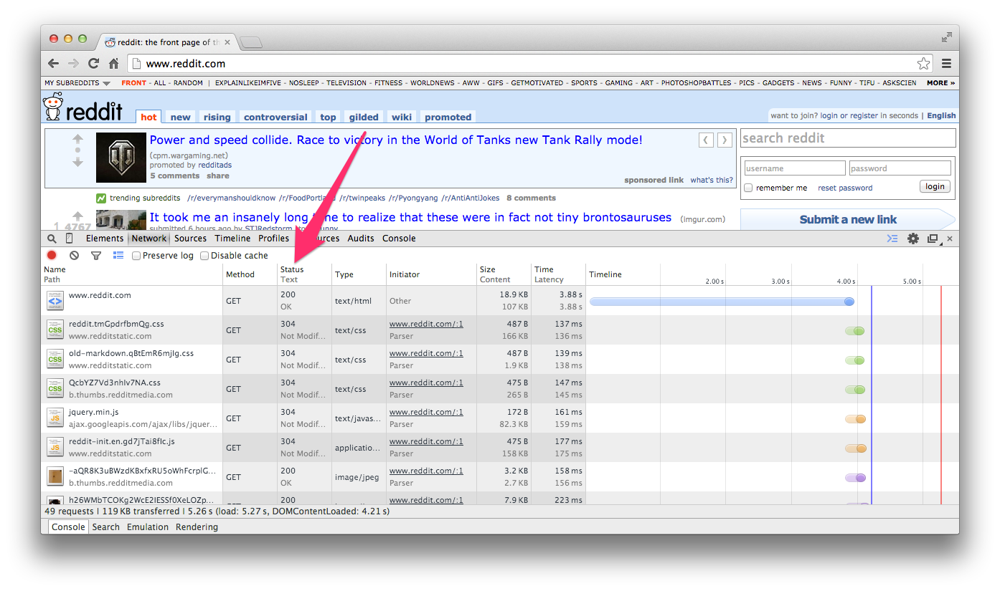
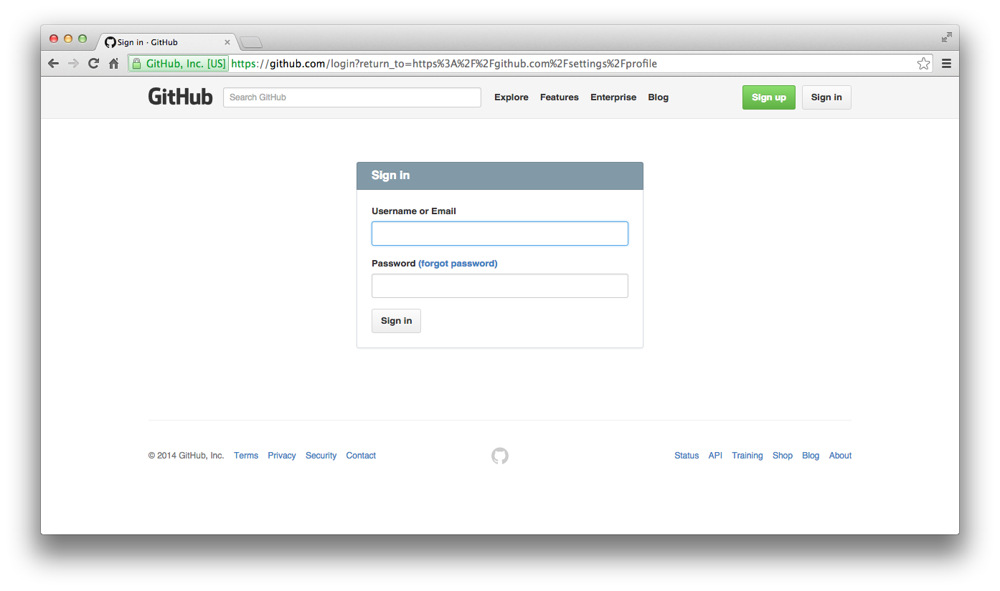
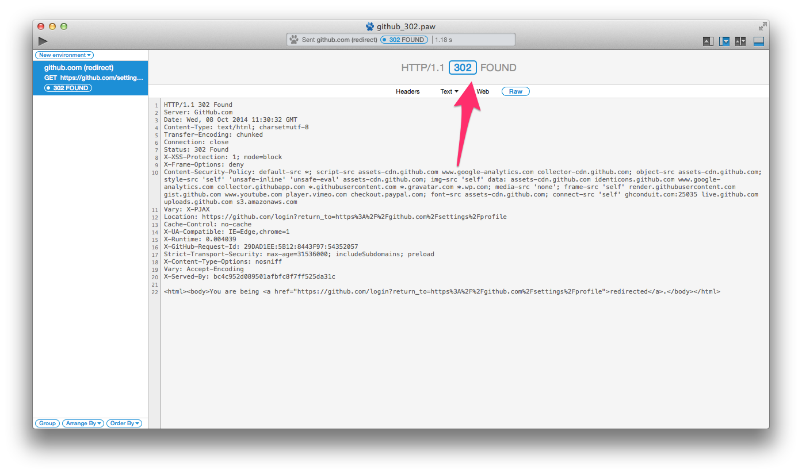
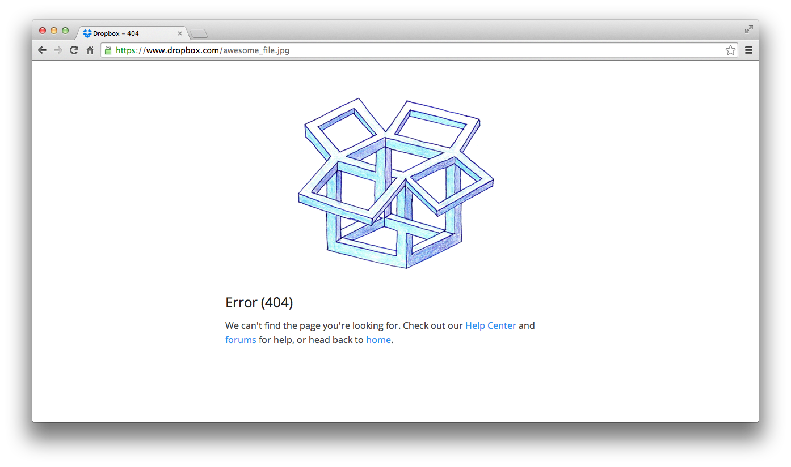
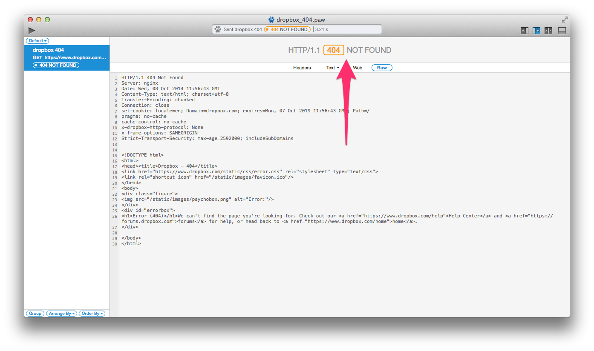
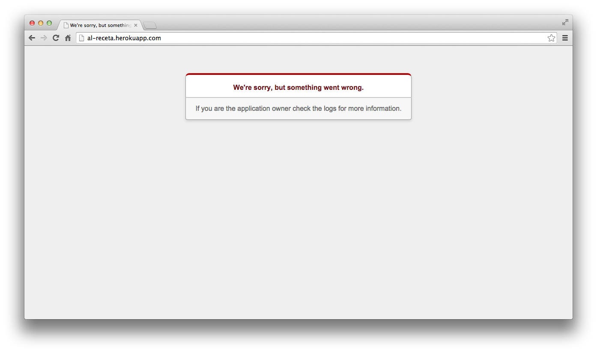
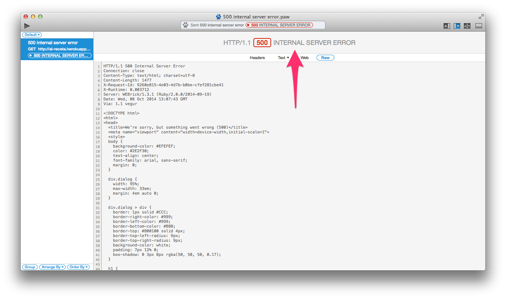
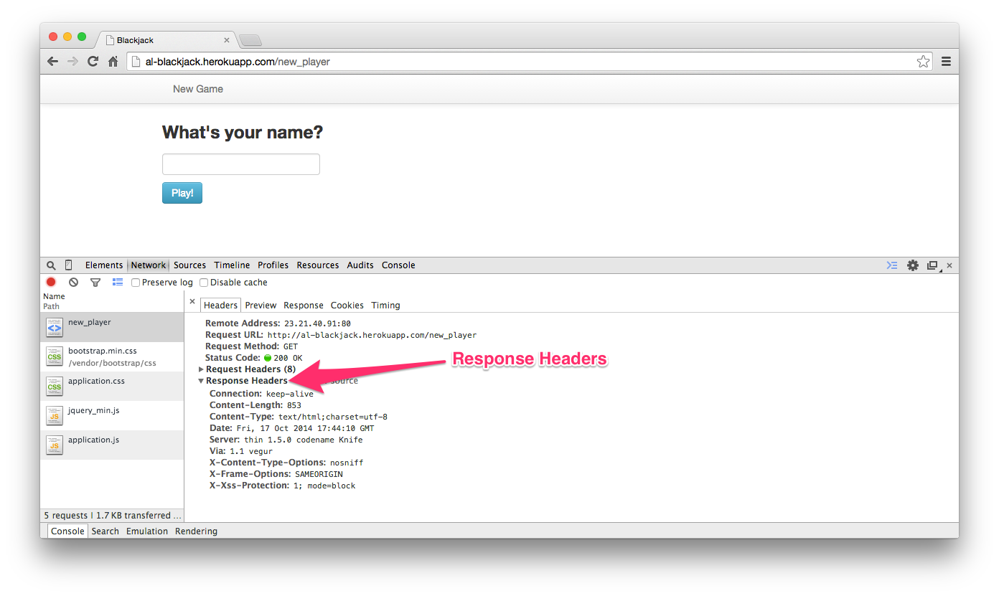
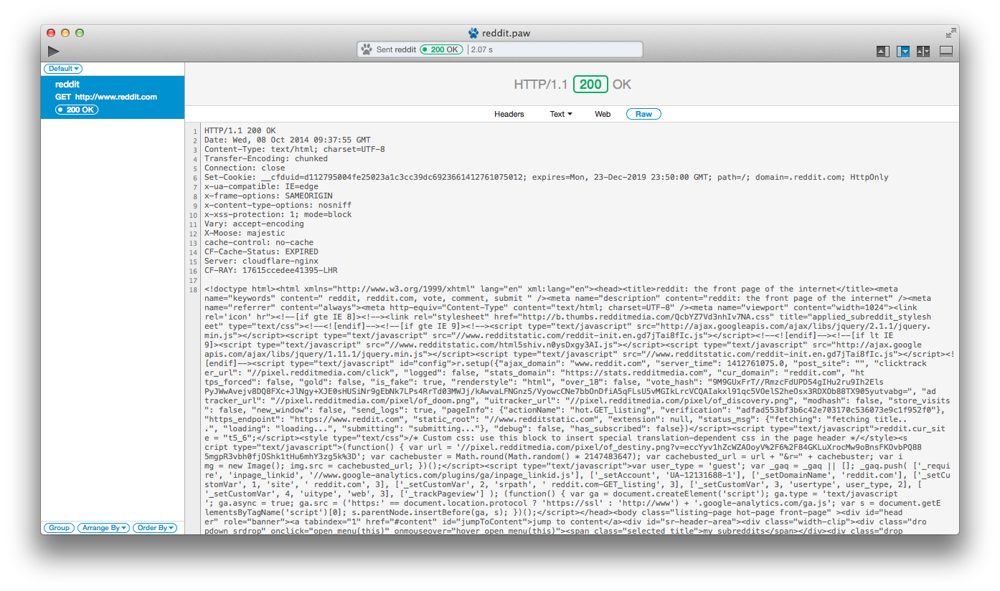

#处理响应

###简介
目前为止我们已经发起了各种各样的请求, 也看到了服务器发回的原始HTTP数据.服务器返回的原始数据就是所谓的**响应**.本章我们会分析HTTP响应里的各种组成部分.

###状态码
我们要看的第一个组成部分是HTTP状态码.```状态码```是服务器接收到请求后返回的标识请求状态的三位数.在```状态码```的旁边,就是描述这个状态码的```状态文本```.一般这些出现在审查器的```Status```这列:

你遇到的最常见的响应状态码应该是200, 意思是请求被正确处理.让我们来看看其他有用的状态码:

|状态码  | 状态文本 | 含义 |
|:------------- |:---------------| :-------------|
| 200 | OK | 请求被正确处理 |
| 302 | Found | 所请求的资源已暂时更改.通常会重定向到另一个URL |
| 404 | Not Found | 所请求的资源无法找到  |
| 500 | Internal Server Error | 服务器出现一般性错误 |

作为一个web开发者, 你应该熟知上面的响应状态码和其代表的含义.

让我们来挨个举例看看:

###302 Redirect(重定向)
当一个资源的位置移动了会发生什么呢? 最通用的解决方案是把对旧URL的请求重新引导到新URL上.这种重新引导请求的行为有一个术语叫```重定向```(redirect).当你的浏览器看到一个302响应状态码的时候, 他就知道这个资源已经移动到别处了,然后就会自动跟进```Location```响应头部里重定向的URL.在本节中，我们会专注于浏览器和HTTP工具上下文中的重定向.

比如说你想要看[Github](http://www.github.com/)上的账户配置, 你就要访问这个链接```https://github.com/settings/profile```.但是, 要有访问账户配置页面的权限, 你必须先登录.如果你没有登录就访问这个链接, 浏览器会把你送到登录页面去.当你填写正确的登录信息后, 你就会被重定向到你最早想访问的页面.这个是大多数web应用的通用工作流程.让我们看看浏览器和HTTP工具是怎么处理这个流程的.

首先你在浏览器里输入```https://github.com/settings/profile```.

因为浏览器很聪明很棒, 它会直接按照重定向的指示给你展示出Github的登录页面:

相比之下我们来看看HTTP工具(注意状态码), 它并没有自动跟进重定向:

注意这个```Location```响应头部(有点难找到,在第12行).你应该能看到
```ruby
Location: https://github.com/login?return_to=https%3A%2F%2Fgithub.com%2Fsettings%2Fprofile
```
这个URL里有一个*return_to*参数, 它的值就是在登录之后客户端要重定向到的URL.对比一下浏览器里那张图, 你应该能发现, 这个URL和浏览器地址栏栏里的URL是一样的.

###404 Not Found(未找到)
接下来, 我们看看浏览器里的404响应状态码是什么样.当所请求的资源没有找到的时候, 服务器会返回这个状态码.要记得, 资源可以是任何东西,包括音频文件, CSS文件,javascript文件,图片等等.让我们给```http://www.dropbox.com```发一个```GET```请求索要一张棒极了的图片, ```https://www.dropbox.com/awesome_file.jpg```:

我们看到了Dropbox那漂亮的404页面.现在让我们在HTTP工具里看看同样的请求的响应:

因为我们索要的资源并不存在, 浏览器给我们展示了一个格式友好的文字提示, 同样的HTTP工具会给我们展示响应状态码和其原始响应数据.

###500 Internal Server Error(内部服务器错误)
一个500状态码意思就是'服务器那儿好像出了点儿问题'. 这只是一个一般性的错误状态码, 造成这个错误的原因可能是服务器配置, 也可能是跑在服务器上的应用里的代码少写个逗号.但是不管是什么问题, 总之是服务器端有问题.有服务器访问权限的人必须去调试和解决这个问题, 这就是为什么很多含糊的报错信息都会提醒你去联系你的系统管理员.在实际应用上, 500错误也可以像404那样以多种多样的形式显示出来.下面就是rails应用默认的500页面:

使用HTTP工具,我们能看到状态码和原始数据:

###响应头部
跟请求头部一样, 我们也可以用审查器去看响应头部:

响应头部提供了更多关于服务器返回的资源的信息.让我们来看看一些常见的响应头部:

|头部名称  | 描述 | 举例 |
|:------------- |:---------------| :-------------|
| Content-Encoding | 数据的编码类型 | Content-Encoding: gzip |
| Server | 服务器的名称 | Server:thin 1.5.0 codename Knife |
| Location | 提醒客户端新资源的位置 | Location: http://www.github.com/login |
| Content-Type | 响应数据包含的类型 | Content-Type:text/html; charset=UTF-8 |

还有很多响应头部, 但是跟请求头部一样, 没有必要去背下来. 响应头部对返回的数据有着微妙的影响, 有些情况下, 它们巧妙的用于工作流程中(比如,你的浏览器自动跟进```Location```响应头部指向的URL).你需要理解的仅仅是, 响应头部包含了一些关于返回的响应数据的额外信息(译注:描述数据的信息/数据, 通常被成为元数据, meta-data or meta information).

###小结
在本章, 我们讨论了HTTP响应的组成部分.我们也了解了如何使用审查器去查看HTTP响应的头部.尽管我们只是揭开了HTTP协议面纱的一角, 我希望这些知识在你需要的时候能给你[深入研究HTTP](http://en.wikipedia.org/wiki/Hypertext_Transfer_Protocol)的动力.

总之，我们已经看到, HTTP只不过是一个协议，用于指示客户端与服务器之间如何使用某种格式的文本进行通信。

HTTP响应中最重要的部分如下:
* 状态码
* 头部
* 消息正文, 里面有原始响应数据

试试看, 在下面这个图里你能不能找到上面那几个部分都在哪儿:

