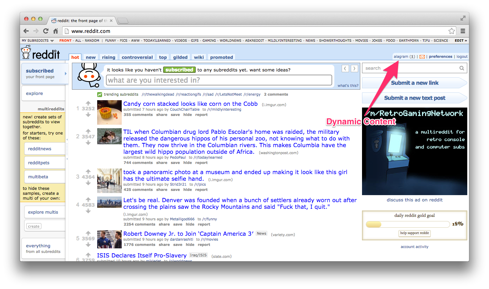
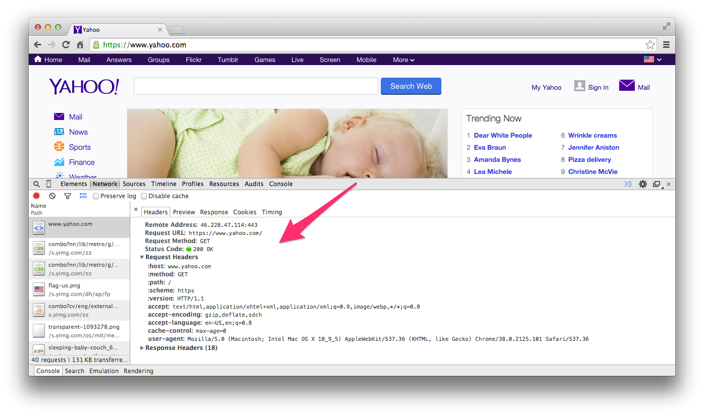
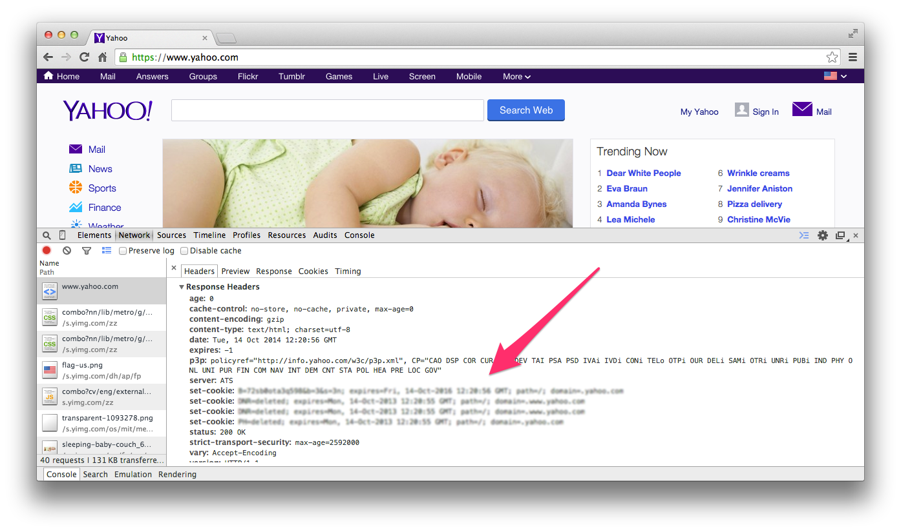
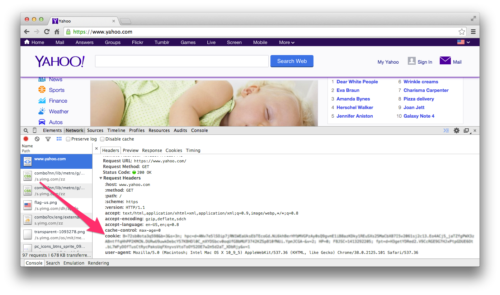
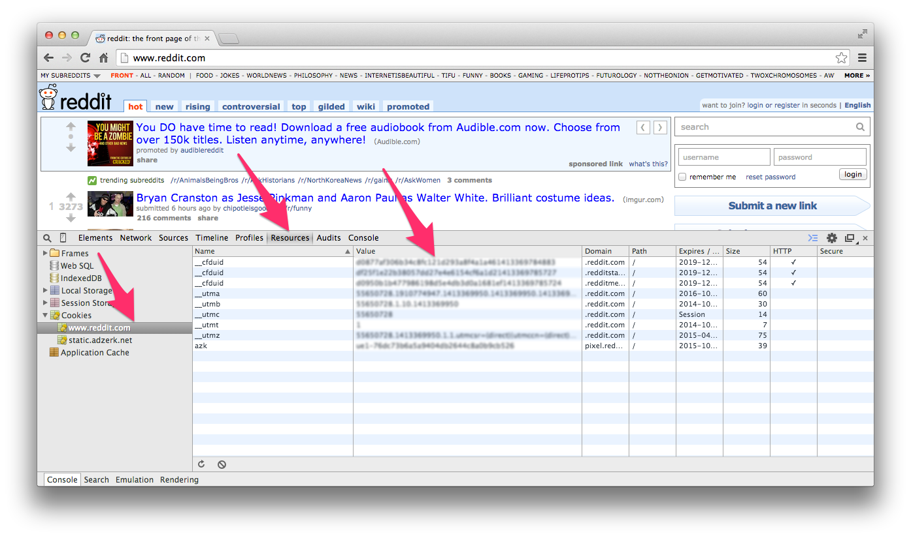
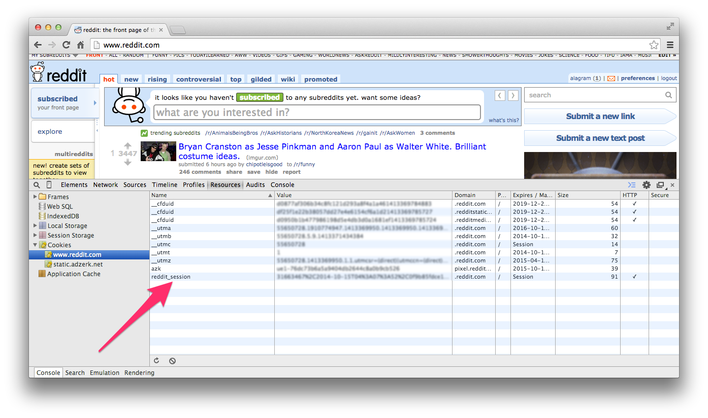
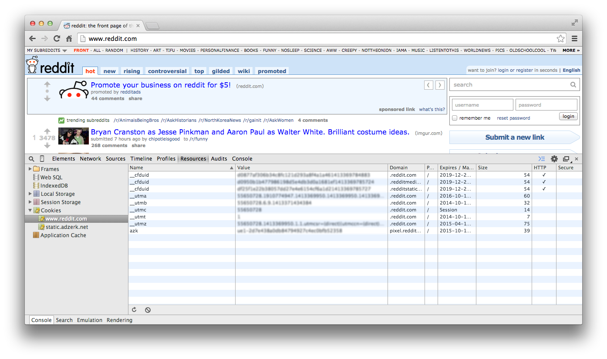
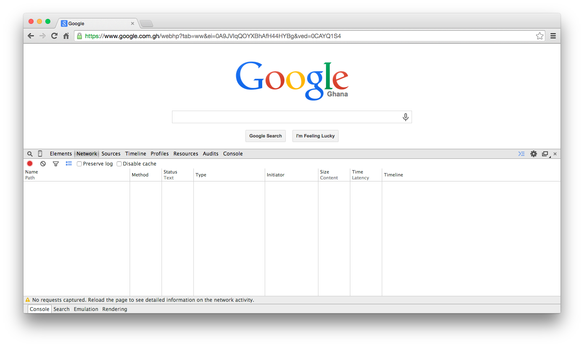
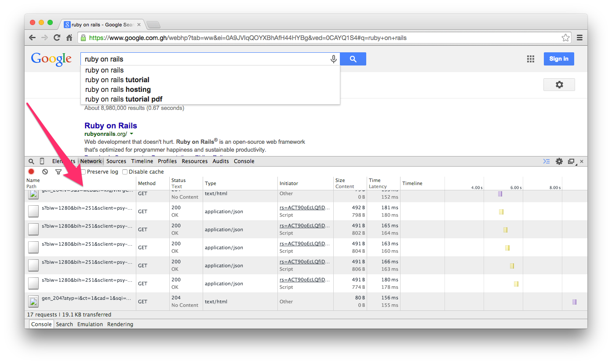

# 有状态的 web 应用

### 简介
HTTP 协议是无状态的。换句话说，在你的各次请求之间，服务器是不会保留你的 “状态” 信息。


每一次请求都被认为是一次全新的请求，不同的请求之间并不知道对方的存在.这种” 无状态性 “使得 HTTP 和互联网都是 “去中心化” 的，不会轻易被人掌控。 但也是因为这种属性，使得 web 开发者在开发有状态的 web 应用时十分的困难。

当我们看看我们熟悉的 web 应用，我们会觉得这些应用大都是有状态.比如，我们登录到 Facebook 或者 Twitter ，会看到我们的用户名显示在网页上方，这表示我们的目前状态是通过了身份验证。如果我们在页面上随便点点（对服务器发起新的请求)，我们并不会突然就退出登录了。 服务器返回的响应页面里依然有我们的用户名显示着，这样看来这些应用似乎都会维持它们的状态。

在本章，我们会通过讨论一下这是怎么回事，看看 web 开发者常用的实现 “有状态” 体验的技术手段。同时，也会讨论一些用于高效展示动态页面信息的技术。会讨论以下技术:

* 会话（ session ）
* Cookies
* 异步 javascript 调用（ AJAX ）

### 一个有状态的应用
让我们来看一个有状态的应用。当你发起一个请求到```http://www.reddit.com```的时候，主页是这样的:


然后输入你的用户名和密码进行登录：



登录后，在页面上方你就会看到你的用户名，表示你已经成功通过身份验证。如果你刷新页面，就会向```http://www.reddit.com```服务器发起一个新的请求，你会看到，页面还是那个样子，你的登录状态还在。这是怎么回事呢？ HTTP 不是一个无状态协议么？服务器是怎么知道你的用户名，并动态显示在页面上的？哪怕刷新页面发起新的请求也不影响你的登录状态。这种情况非常常见，我们都习以为常了。 这就是你的网络购物车在你往里加新商品的时候如何保留着你之前的选择，有时候哪怕过了几天，你也能看到你购物车里的东西。这就是 Gmail 如何认出你，并在页面上显示针对你名字的欢迎信息，所有的现代 web 应用都是这样工作的。

### 会话 （ session ）
显然，人们可以把这个无状态的 HTTP 协议通过某种方式保持状态。在客户端（一般就是指浏览器）的帮助下，HTTP 的行为会让人觉得它会在客户端与服务器之间维护一个有状态的连接，尽管实际并没有。达到这种效果的一个办法就是， 服务器在发送响应数据给客户端的时候带一个唯一的令牌（英文叫 token，就是一串数）。随后不论何时客户端向服务器发起请求的时候都把这个令牌附加在后面，让服务器能够辨识这个客户端。在 web 开发领域我们把这个来回传递的令牌叫做会话标识符（ session identifier ）。

这种在客户端与服务器之间传递```会话 id```的机制，能让服务器创建一种各次请求之间的持续连接状态。Web 开发人员利用这种人造的状态，来构建复杂的应用程序。即使这样，每一个请求严格上来说还是无状态的，各次请求之间并不知道彼此的存在。

这种人造状态，会有几个后果。第一，必须检查每个请求，查看它是否包含会话标识符。第二，如果请求有会话标识符，也就是有一个会话 id，服务器必须检查每一个会话 id ，确保这些会话 id 是没有过期的，也就是服务器需要维护一些关于如何处理会话过期，如何存储会话数据的规则。第三，服务器要基于这个会话 id 取出这个会话的数据。最后，服务器要根据取出的会话数据重新创建应用程序的状态（ 比如，一个请求对应的 HTML )，然后将其作为响应返回给客户端。

这就意味着服务器必须非常辛勤的工作，来模拟这个有状态的用户体验。每一个请求都会有一个独立的响应，哪怕这次的响应跟前一个响应没有任何区别。举个例子，如果你登录到 Facebook 上，服务器会给你一个响应，生成你看到的主页。这个响应是一个十分复杂的 HTML 页面。Facebook 的服务器会把页面上所有照片和留言的赞和评论都组合起来，然后显示在你的时间线上。生成这样一个页面的成本非常高。现在，如果你点了某个照片下面的” 赞 “链接，理论上，Facebook 会重新生成整个页面，它会把你赞过的照片的被赞数加 1，然后把整个 HTML 作为响应返回给你，尽管除了这个赞数以外大部分内容都没有改变。 庆幸的是，实际中 Facebook 使用 Ajax 代替了全页面刷新。不然的话，刷新一个页面会花费很长时间。


服务器使用了很多先进的技术来优化会话和实现安全机制，不过这些话题都超出了本书的范围，暂且放下。现在我们来聊一个常用的存储会话信息的方法: 浏览器 cookie 。

### Cookies
cookie 就是在一个请求 / 响应周期内，服务器发送给客户端（通常就是浏览器），并存储在客户端的一段数据。Cookies 或者 HTTP cookies，就是存储在浏览器里包含着会话信息的小文件。默认情况下，大部分浏览器的 cookies 都是启用的。当你第一次访问一个网站的时候，服务器会给你发送会话信息并将其存储在你本地电脑浏览器的 cookie 里。要注意的是真正的会话数据是存在服务器上的。在客户端发起每一个请求的时候，服务器就会比对客户端的 cookie 和服务器上的会话数据，用来标识当前的会话。通过这种方法，当你再次访问同一个网站的时候，服务器就会通过 cookie 和里面的信息来认出你的会话。


我们来看一个真实的案例。用审查器看看 cookies 是如何被创建的。我们要向```http://www.yahoo.com```发起一个请求。要注意的是，如果你的浏览器里已经有了 Yahoo 的 cookie ，你可能需要换一个网站。

保持审查器打开（页面上右键，点击 “查看元素 “），输入这个网址，然后看看我们的请求头部：



注意，里面没有任何有关 cookies 的东西，接下来我们看看响应头部：



你会看到有个```set-cookie```头部把 cookie 数据加到响应里。 在首次访问这个网站的时候这个 cookie 数据会被设置。最后，我们发起一个相同的请求然后再来看看请求头部：



你会看到有个```cookie```头部出现了（注意这个是请求头部，就是说这是要从你的客户端发送到服务器的）。 里面的内容是上一个响应头部```set-cookie```的值。这一小段数据，会出现在你每一个发起的请求里，用来唯一标识你 --- 或者说的清楚点， 标识你的客户端，也就是你的浏览器。cookie 是存在浏览器里的。现在，就算你关掉浏览器，关掉电脑， cookie 里的信息也不会消失的。

现在让我们回到本章最初的那个例子，关于 Reddit 和其他 web 应用是如何在我们发起的一个又一个请求中记住我们的登录状态。记住，每一个请求都是独立的， 不知道彼此存在的。 那么问题来了，应用程序是如何 “记住” 我们的登录状态呢？如果你要跟着做， 保持审查器打开，然后按照下面的步骤来：

1. 点击 resources 标签然后访问```http://www.reddit.com```
2. 把 cookies 那部分展开， 然后点击```www.reddit.com```，你就能在 value 那一列看到第一次发起请求后服务器返回给我们的 cookie 了:
3. 然后登录，你应该能看到在最后一行出现了一个唯一的会话 id 。这个会话 id 会存在你浏览器的 cookie 里，从此后你每一个到 Reddit.com 的请求都会附上这个会话 id 。

现在每一个请求都会包含这个会话 id ，这样服务器就能唯一确认你这个客户端啦。当服务器接收到一个带有会话 id 的请求，它就会根据这个 i d 去找对应的数据，在这个对应的数据里就有服务器"记住"的客户端的状态，或者说就是这个会话 id 的状态。

>#### 会话数据存在哪里？
>一句话：服务器上的某个地方。有时候，存在内存里，其他时候，可能会存在某个持久化存储介质上，比如数据库或者键 / 值存储。会话数据存在哪里不是我们现在需要关心的。现在重要的是要理解会话 id 存储在客户端，它是访问存储在服务器上的会话数据的 “钥匙”。web 应用就是这样解决 http 无状态这个问题的。

还有一点非常重要，在一个会话里发出的会话 id 是唯一的，而且有一个很短的过期时间。对上面的例子来说，在会话过期后你需要重新登录。如果我们退出登录， 会话 id 就会消失。



如果你手动删掉会话 id 也是同样的效果（在审查器里，右键 cookies 然后删除它），这样就退出登录了。

简单回顾一下，会话数据是由服务器生成并存储在服务器上，会话 id 以 cookie 的形式发送到客户端上。我们还看到了 web 应用程序如何充分利用这些来模拟在 web 上的有状态体验。

### AJAX
最后，我们来简单看看 AJAX 和它在 HTTP 请求 / 响应周期里的作用.AJAX 是” 异步 javascript 和 XML “ 的简称（ Asynchronous JavaScript and XML ）。它的主要特点就是允许浏览器发送请求和处理响应的时候不用刷新整个页面。举个例子，如果你登录到 Facebook 上，服务器会给你一个响应，生成你看到的主页。 这个响应是一个十分复杂的 HTML 页面。Facebook 的服务器会把各种信息组合起来，显示在你的时间线上。在前面的讨论中，我们知道，为每一个请求都重新生成一次页面的成本是非常高的（记住，你的每一个动作，点个链接，提交个表单，都会发起一个新的请求）。

当使用 AJAX 的时候，所有客户端发送的请求都是异步的，就是说页面不会刷新。举个例子，当我们在 google 上搜索的时候：

* 访问 Google 主页```http://www.google.com```，然后打开审查器，看 Network 标签，里面内容是空的。 
* 当你开始搜索的时候，你会在 Network 标签看到请求如潮水般发起。 

很明显发起了很多请求，但是你应该能注意到，页面没有整个刷新。 然而这个 Network 标签的内容让我们看清： 每敲一个字都会发起一个新的请求，也意味着你每按一下键都会触发一个 AJAX 请求。这些请求的响应会通过一些回调来处理。你可以这样理解```回调```，就是你把一些逻辑存放在某个函数里，当某个条件被触发之后再回来执行你前面存放的逻辑。在本例中，当响应返回的时候，回调就会被触发。你可能已经猜到了，回调函数会用新的搜索结果去更新网页上的 HTML 。

我们不去深究回调到底是什么样的或者如何发起一个 AJAX 请求。最主要的一点要记住的是，AJAX 请求就像是普通请求：发送到服务器的请求依然跟普通请求一样有着一个 HTTP 请求该有的所有组成部分，并且服务器处理 AJAX 请求的方法跟处理普通请求也是一样的。唯一不同就是，不是通过浏览器刷新来处理响应，而通常由客户端的一些 javascript 代码来处理。

### 小结
本章我们介绍了一些 web 开发者用来在无状态的 HTTP 协议上构建有状态应用的技术。你学习了 cookie 和会话，以及现代 web 应用如何记住客户端的状态。也使用审查器了解了 cookies 和会话 id 。最后，了解了 AJAX 在 web 应用里展示动态内容时所扮演的角色。
